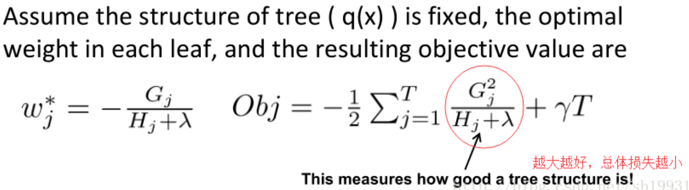
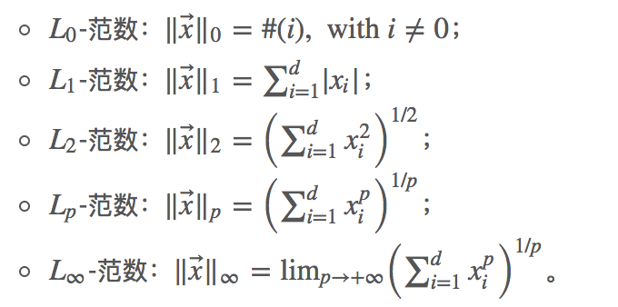
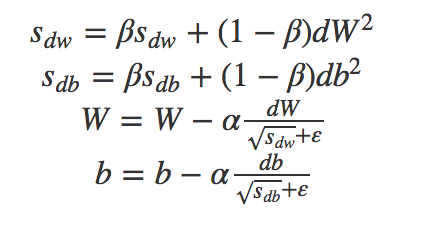
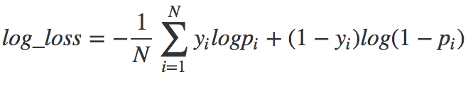

# classic Machine Learning

## 1.监督学习

### 1.1线性回归

在线性回归中，它假设样本和噪声都服从高斯分布。 预测方程：hθ\(x\)=Wx

Loss function： J\(θ\)来LMS**最小均方**描述误差


**Q1为什么采用最小平方的形式？**

A：观测输出与预估数据之间的误差为ε，认为ε服从正态分布。参数ε的极大似然估计\(u,σ^2\)，即是说，在某个\(u,σ^2\)下，使得服从正态分布的ε取得现有样本εi的概率最大。极大似然估计，相当于又是一个求极值的问题，求偏导。

想让误差ε尽可能的小，那最好是均值u和方差σ趋近于0或越小越好。方差的偏导项恰好满足有平方项。由此。

函数目标是最小损失函数，实际上也可以理解为何时可以让损失函数达到最小值。

共线性对线性回归的影响：参数的方差变大。难以区分每个解释变量的单独影响。变量的显著性检验失去意义；回归模型缺乏稳定性。影响模型的泛化误差。但是不影响预测能力，只会影响系数估计。

### 1.2 逻辑回归

最小二乘法是高斯分布下最大似然估计的一般结果，LR是伯努利分布下最大似然估计的一般结果\(交叉熵损失\)。L2可以解决多重共线性。计算梯度的时候可以做一个并行化的设计。L1可以解决特征稀疏，输出为一个概率。

为什么要采用sigmoid作为它的激活函数。在假设label是0-1分布之后，由于伯努利分布为指数族分布，将其化成标准的指数族分布的形式的时候


得到其中的eta=log\(P/\(1-P\)\),推导出P=1/\(1+exp\(-eta\)\)。而我们的函数目标E\(y\|x;sigma\)=P。

另外一种解释方法，假设两个类别的特征是服从高斯分布的情况，因为高斯分布是满足熵最大的分布，满足假设的前提下，越均匀越好。求log的几率，通过P\(y\|x\)大小取决于P\(x\|y\)P\(y\)。展开可得log几率=wx，从而推导出sigmoid，log几率的性质让它满足归一化属于0，1之间

解决分类问题，本质还是线性回归，套上了一个sigmoid的函数。


 θ函数的值有特殊的含义，它表示 hθ\(x\)结果取1的概率


从**最大似然估计**的眼光看我们的目标实际上是最大化下面的公式，即在规定的参数下发生的可能性最大,连乘会导致近似于0：


LR是一种广义的线性回归模型，平方损失函数的话，对于Sigmoid函数求导计算，无法保证是凸函数，在优化的过程中，求得的解有可能是局部最小，不是全局的最优值。其二：取完对数之后，对我们的后续求导比较方便。

根据似然函数，直接计算，有两点缺点：\(1\)不利于后续的求导，\(2\)似然函数的计算会导致下溢出。

在求解非线性问题的时候，不能再表示为wx+b的模式，只能表示为相应的对偶形式。由于LR时需要考虑每个数据点，那么在采用对偶形式时，存储的不仅有每个数据点的信息，还必须存储参数alpha

从**交叉熵**引出loss function

由相对熵\(relative entropy\)又称为KL散度（Kullback-Leibler divergence），KL距离，是两个随机分布间距离的度量。记为DKL\(p\|\|q\)DKL\(p\|\|q\)。它度量当真实分布为p时，假设分布q的无效性。 p=q时，KL散度为0.

CEH\(p,q\)=Ep\[−logq\]=−∑x∈Xp\(x\)logq\(x\)=H\(p\)+DKL\(p\|\|q\)CEH\(p,q\)=Ep\[−log⁡q\]

=−∑ p\(x\)log⁡q\(x\)=H\(p\)+DKL\(p\|\|q\)

 交叉熵与上一节定义的相对熵仅相差了H\(p\),当p已知时，可以把H\(p\)看做一个常数，此时交叉熵与KL距离在行为上是等价的，都反映了分布p，q的相似程度。最小化交叉熵等于最小化KL距离。

 在logistic regression中， p:真实样本分布，服从参数为p的0-1分布，即X∼B\(1,p\) q:待估计的模型，服从参数为q的0-1分布，即X∼B\(1,q\)

CEH\(p,q\)=-\(P\(x=0\)logQ\(x=0\)+P\(x=1\)logQ\(x=1\)\)

=-\(\(1-p\)log\(1-q\)+plog\(p\)\)

=-\(\(1-y\)log\(1-h\(x\)\)+ylog\(h\(x\)\)\)

在数据线性可分的情况下，w中元素的绝对值越大，目标函数就越小，这时就需要加入**正则化**

**log loss：-logP\(Y\|X\)**

#### ​Softmax 多分类


多分类的问题上，假设数据为多项式分布，softmax输出是一个概率分布

真实的类标签可以看作是分布，对某个样本属于哪个类别可以用One-hot的编码方式，是一个维度为C的向量，比如在5个类别的分类中，`[0, 1, 0, 0, 0]`表示该样本属于第二个类，其概率值为1。我们把真实的类标签分布记为p，该分布中，ti=1当i属于它的真实类别c CEH\(p,q\)=−∑ label\(x\)log⁡q\(x\)

意义：

1.交叉熵本身可以衡量模型分布和真实分布的相似程度

2.利用交叉熵权重参数的偏导数由σ\(z\)−y控制，模型的输出与标签y之间的偏差越大，也就是σ\(z\)−y的值越大，那么偏导数就会越大，学习就会越快.cross entropy 计算 loss，则依旧是一个凸优化问题，用梯度下降求解时，凸优化问题有很好的收敛特性, 若采用MSE则有多个局部最优解, 并且预测值接近真实值\(即σ\(z\) 或者\(1−σ\(z\)\)接近0时，更新项η⋅\(a−y\)⋅σ\(z\)⋅\(1−σ\(z\)\)接近0，梯度出现“消失”现象

### 1.3 朴素贝叶斯


朴素贝叶斯针对特征向量x为离散的情况，其最重要的假设在特征分量相互独立

```text
贝叶斯公式 + 条件独立假设 = 朴素贝叶斯方法
```

当特征向量x为连续时， 假设其值为正态分布

在机器学习中B=label y，A=input X，由于X有m features组成，

so P\(B\|A\)=P\(y\|X\)=P\(y\|X1,X2,X3,....Xm\)=P\(y\|X1\)\*P\(y\|X2\)....P\(y\|Xn\)

P\(y\|X1\)=P\(X1\|y\)\*P\(y\)/P\(X1\)

在文本情感分类任务中，xi代表一个个单词，P\(Xi\|y\)代表单词Xi在y=0或者y=1的占比情况，P\(y\)代表样本概率,P\(Xi\)代表在总文本中占比。当然，由于这个最终是要做比较的是分子，那么分母其实是没有关系的，不算也可以，节省工作量^-^。朴素贝叶斯实际上比较的就是P\(B\|A\) 的后验概率。如果这个单词没有出现过，那么就会做一个laplace平滑的操作，分子+1，分母+vocabulary size

### 自然语言处理中的概率图模型

先验概率：事件发生前的预判概率。可以是基于历史数据的统计，可以由背景常识得出，也可以是人的主观观点给出。一般都是单独事件概率，如P\(x\),P\(y\)。

后验概率：基于先验概率求得的反向条件概率

朴素贝叶斯在一定条件下可以变成逻辑回归。在比较后验概率的时候，P\(B1\|A\)/P\(B2\|A\)的大小，为了防止数太小造成的overflow则采用log的形式。逻辑斯特回归实际上是用线性回归模型的预测结果去逼近后验概率的逻辑发生比，即比较log\(P\(y2\|X\)/P\(y1\|X\)\)。

**因为条件独立假设，朴素贝叶斯可以不使用梯度下降，而直接通过统计每个特征的逻辑发生比来当做权重。**逻辑回归，条件独立假设并不成立，通过梯度下降法，可以得到特征之间的耦合信息，从而得到相应的权重。

朴素贝叶斯序列化之后可以变成隐式马尔可夫模型

逻辑回归在序列化之后可以变成链式条件随机场

### 1.4 SVM

线性可分支持向量机\(硬间隔支持向量机\) 线性支持向量机\(软间隔支持向量机\) 非线性支持向量机\(核函数+软间隔\)。硬间隔需要数据完全线性可分，软间隔可以有离群点噪声松弛变量的影响。

实际上从LR引出结论，越偏离decision boundary的点分类越准确。

考虑要尽可能大的增加functional margin, 以增加acc                                                          functional margin: y^=label\(transpose\(w\)x+b\)                                                                 geometric margin: y^/\|\|w\|\|                    

偏题讲一句，机器学习应用的问题一般都是在做凸函数优化，可以将之lagerange对偶化，然后用牛顿法或者梯度下降法求解。凸函数有全局最优解。凸优化问题：1 x是闭合的凸集 2 f是x上的凸函数最优化问题。                                                          凸函数：f\(tx+\(1-t\)y\)&lt;=tf\(x\)+\(1-t\)f\(y\)

此时的goal function geometric margin为非凸优化问题，将约束条件\|w\|=1向上提得到要最小化几何间隔,为了保证\(w,b\)的唯一性，规定有y^=1, 因为这个函数间隔和几何间隔有如下的关系：几何间隔=函数间隔／\|w\|，goal function 变成 max 1/\|\|w\|\| equals to min 0.5\*\|\|w\|\|^2.

因为当样本的维度很高时，对于每个样本在计算yi\(wxi+b\)&lt;=0，时间复杂度是特征维度数目，所以每轮每个样本迭代速度很慢。到此引入拉格朗日对偶，原因：通过引入对偶问题，将算法的复杂度与样本维度有关，引入对偶问题将问题复杂度缩小到和算子数目有关，判断的公式变成了只和样本中算子数目有关，是从1到N的，只和样本数目有关。

若要primal 和dual有相同解，则要求f为凸函数，且对偶式对w和beta偏导为0，从而引出KTT条件。                                                                       KTT条件可引出，1.𝛂g\(w\)=0 ,  2. 𝛂&gt;=0,    3. g\(w\)&lt;=0 ⊫ if 𝛂&gt;0 then g\(w\)=0

在SVM中g\(w\)=0 意味着函数间隔为1向量。同时对对偶求偏导，可得                        wx+b= sum 𝛂y\(i\)&lt;x\(i\),x&gt;+b 此时我们仅需考虑支撑向量即可。惩罚因子C决定了你有多重视离群点带来的损失，你定的C越大，对目标函数的损失也越大，此时就暗示着你非常不愿意放弃这些离群点，

求𝛂优化的工作交给SMO

从另外一个角度考虑，不管怎样我们希望。  
那么，如果实际上符号为负，或者虽然符号为正但离0不够远，具体来说是，我们就认为这个分类错误（或“不够正确”）带来了大小为的损失。  
于是目标函数（损失函数）就是，在数据线性可分的情况下，会有许多w使得L = 0。为了选择一个合理的w，也需要加入L2正则化。

SVM中的称为**hinge loss**

因为有核函数的存在，所以处理高维数据比较有效。核函数的价值在于它虽然也是讲特征进行从低维到高维的转换，但核函数绝就绝在它事先在低维上进行计算，而将实质上的分类效果表现在了高维上，也就如上文所说的避免了直接在高维空间中的复杂计算。只需要用到支持向量，所以空间效率高。

如果如果特征数远远大于样本数的情况下,使用线性核就可以了。

多项式核，这个核就是最开始提到过的会将原始空间映射为无穷维空间的那个家伙。多项式形式的核函数具有良好的全局性质。局部性较差。

RBF核、高斯核：主要用于线性不可分的情形。参数多，分类结果非常依赖于参数。有很多人是通过训练数据的交叉验证来寻找合适的参数，不过这个过程比较耗时。我个人的体会是：使用libsvm，默认参数，RBF核比Linear核效果稍差。通过进行大量参数的尝试，一般能找到比linear核更好的效果。如果特征数远小于样本数,这种情况一般使用RBF。空间中任一点x到某一中心xc之间欧氏距离的单调函数，γ主要定义了单个样本对整个分类超平面的影响。展开成为无限维度的原因，对其展开，然后对中间项进行泰勒展开，从而拟合了无限维。gamma就是模型选择样本作为支持向量的影响半径的倒数。


当特征维数远大于样本数时效果不好。训练和预测速度慢

### 1.5 bias/variance tradeoff

**偏差（bias）**描述的是通过学习拟合出来的结果之期望，与真实规律之间的差距，记作 Bias\(X\)=E\[f^\(X\)\]−f\(X\)。所有可能的训练数据集训练出的模型输出值与真实模型之间的差异

**方差（variance）**即是统计学中的定义，描述的是通过学习拟合出来的结果自身的不稳定性，数据扰动造成的影响，记作 Var\(X\)=E\[f̂ \(X\)−E\[f̂ \(X\)\]\]。不同训练数据集训练出的模型输出之间的差异。


从这张图上看variance和bias是负相关的


low bias 即复杂化模型易出现over fitting

low variance 简化模型易出现under fitting

#### 欠拟合 {#欠拟合}

当模型处于欠拟合状态时，根本的办法是增加模型复杂度。我们一般有以下一些办法：

* 增加模型的迭代次数；
* 更换描述能力更强的模型；
* 生成更多特征供训练使用；
* 降低正则化水平。

#### 过拟合 {#过拟合}

当模型处于过拟合状态时，根本的办法是降低模型复杂度。我们则有以下一些武器：

* 扩增训练集；
* 减少训练使用的特征的数量；
* 提高正则化水平

K折交叉验证，初始采样分割成K个子样本，一个单独的子样本被保留作为验证模型的数据，其他K-1个样本用来训练。交叉验证重复K次，每个子样本验证一次，、我们便可获得 k 个模型及其性能评价。平均K次的结果或者使用其它结合方式，最终得到一个单一估测。

### 1.6 Bagging和Boosting的区别：

**bagging**的名称来源于 （ **B\*\*ootstrap \*\*AGG\*\*regat\*\*ING** ），意思是自助抽样集成，有放回的抽取数据集，这种方法将训练集分成m个新的训练集，然后在每个新训练集上构建一个模型，各自不相干，最后预测时我们将这个m个模型的结果进行整合，得到最终结果。整合方式就是：分类问题用majority voting，回归用均值。方差的原因在于拟合噪声，bagging是因为随机抽取data的子集合，噪音就因为比较少，参加各个模型train的部分也少，相当于各个基模型减少了噪音的影响，所以减少了方差。

对每一个子训练集而言，对应学得的基分类器拟合程度相当高，甚至可以认为对子训练集都是过拟合了的，所以针对boost而言它的起点就是一个偏差小、方差大的集成，而他接下来的目的就是为了降低方差，减小由数据扰动带来的影响。

RF就是bagging中的一种

boosting: 其主要思想是将弱分类器组装成一个强分类器, 通过提高那些在前一轮被弱分类器分错样例的权值，减小前一轮分对样例的权值，来使得分类器对误分的数据有较好的效果。通过加法模型将弱分类器进行线性组合，比如AdaBoost通过加权多数表决的方式，即增大错误率小的分类器的权值，同时减小错误率较大的分类器的权值。

他的每一个基分类器是比较简单的弱分类器，而数据集其实一直都是整个样本全集，只是每一轮迭代修改了部分样本的权重（使整体的样本分布变化），所以初始的基分类器的拟合效果自然不好，也就是起始的时候偏差大、方差相对小

1）样本选择上：

Bagging：训练集是在原始集中有放回选取的，从原始集中选出的各轮训练集之间是独立的。所有预测器的权重相同

Boosting：每一轮的训练集不变，只是训练集中每个样例在分类器中的权重发生变化。而权值是根据上一轮的分类结果进行调整。分类误差小的会有更大的权重

2）样例权重：

Bagging：使用均匀取样，每个样例的权重相等

Boosting：根据错误率不断调整样例的权值，错误率越大则权重越大。

3）预测函数：

Bagging：所有预测函数的权重相等。

Boosting：每个弱分类器都有相应的权重，对于分类误差小的分类器会有更大的权重。

4）并行计算：

Bagging：各个预测函数可以并行生成，并行

Boosting：各个预测函数只能顺序生成，因为后一个模型参数需要前一轮模型的结果。串行

### 1.7 决策树以及其他

决策树（decision tree）是一个树结构（可以是二叉树或非二叉树）。其每个非叶节点表示一个特征属性上的测试，每个分支代表这个特征属性在某个值域上的输出，而每个叶节点存放一个类别。树模型自适应非线性，随着决策树的生长，能够产生高度非线性的模型，svm需要提前指定核函数。树型的损失函数，可以当作为负的增益，每轮分类节点时采用增益最大，即负的增益最小。

多重共线性不影响树模型，因为如果先采用了其中一个变量作为分裂节点，那么不会再采用其他节点作为分裂，因为这些同线性的节点分裂不会产生新的有效信息。

尽可能“纯”就是尽量让一个分裂子集中待分类项属于同一类别。分裂属性分为三种不同的情况\[1\]：   
1、属性是离散值且不要求生成二叉决策树。此时用属性的每一个划分作为一个分支。   
2、属性是离散值且要求生成二叉决策树。此时使用属性划分的一个子集进行测试，按照“属于此子集”和“不属于此子集”分成两个分支。   
3、属性是连续值。此时确定一个值作为分裂点split\_point，按照&gt;split\_point和&lt;=split\_point生成两个分支。

one-hot编码不适合在tree model中，因为在tree中用独热编码，意味着每一个决策节点上只能用one-vs-rest。特征维度高时，每个类别的样本都会比较少，这时候切分不平衡，切分增益也会小。多个类别时，可以参考word2vec对word的编码方式，训练一个nn，拿隐藏在来做实际编码

#### ID3.5

D为用（输出）类别对训练元组进行的划分，则D的熵为：


pi表示第i个类别在整个训练元组中出现的概率，一般来说会用这个类别的样本数量占总量的占比来作为概率的估计。InforA\(D\)中的j代表属性A中一共v个离散取值. \|Dj\|/\|D\| 即为该属性分裂之后的样本数占全体样本的个数。对其中每种可能的分裂点进行分裂

ID3决策树算法就用到上面的信息增益，信息增益 = 信息熵 - 条件熵。**条件熵**描述了在已知第二个[随机变量](https://zh.wikipedia.org/wiki/%E9%9A%8F%E6%9C%BA%E5%8F%98%E9%87%8F)  的值的前提下，随机变量 的信息熵还有多少。在每次分裂的时候贪心选择信息增益最大的属性，作为本次分裂属性。对于特征属性为连续值，可以如此使用ID3算法：先将D中元素按照特征属性排序，则每两个相邻元素的中间点可以看做潜在分裂点，从第一个潜在分裂点开始，分裂D并计算两个集合的期望信息，具有最小期望信息的点称为这个属性的最佳分裂点，其信息期望作为此属性的信息期望。

ID3有一些缺陷:  1.就是选择的时候容易选择一些比较容易分纯净的属性，尤其在具有像ID值这样的属性，因为每个ID都对应一个类别，所以分的很纯净，ID3比较倾向找到这样的属性做分裂。显然，想象一个极端情况，用ID项作为分割的时候，entropy\(Dv\)=0，那么此时ID的项的信息增益必然是最大的 2. 无法处理连续值的情况

#### C4.5


属性A的可能取值数目越多，则split\_infoA\(D\)的值通常会较大。增益率准则对可取值数目较少的属性有所偏好。

C4.5算法并不是直接选择增益率最大的候选划分属性，而是使用了一个启发式：先从候选划分属性中找出信息增益高于平均水平的属性，再从中选择增益率最高的。 C4.5的思路是将连续的特征离散化。比如m个样本的连续特征A有m个，从小到大排列为a1,a2,...,am,则C4.5取相邻两样本值的平均数，一共取得m-1个划分点，其中第i个划分点Ti表示Ti表示为：Ti=（ai+ai+1）／2。对于这m-1个点，分别计算以该点作为二元分类点时的信息增益。选择信息增益最大的点作为该连续特征的二元离散分类点。比如取到的增益最大的点为at,则小于at的值为类别1，大于at的值为类别2，这样我们就做到了连续特征的离散化。

选择属性的时候使用增益率，分界点的时候采用增益。

#### CART

满叉二叉树。递归构建二叉树


Gini\(D\)反映了从数据集D中随机抽取两个样本，其类别不一致的概率，因此Gini\(D\)越小，数据集D的纯度越高。由于将信息熵的一部分-lnx在x=1时进行一阶泰勒展开，f\(x\)=1-x，在此时信息熵就可以近似转化为gini系数。


 CART \(Classification And Regression Tree\) 算法既可以用于分类，也可以用于回归。对回归树用平方误差最小化准则，预测值为该分类下的y的平均值，对分类树用基尼指数最小化准则，进行特征选择，生成二叉树。对于多个离散特征则采取将目标类别合并成两个超类别。对于连续特征的处理与C4.5相同。Cart树特征用过之后可以再使用，这个时候还是一样看特征的gini或者啥增益。切分时需要确定最佳分裂点和分裂特征。最小化的是左右两个子树的均方差损失之和

Gini更适合连续数值变量， 而Entropy更适合符号型变量。  
Gini降低最小误分率， 而Entropy具有更好的概率解释性。  
Gini运算要比Entropy运算快。

决策树的损失函数，还是用在后剪枝的情况下，自底向上剪枝观察损失函数是否会减小，如果减小那么将父节点作为新的叶子结点

不管是scikit-learn还是mllib，其中的随机森林和gbdt算法都是基于决策树算法，一般的，都是使用了cart树算法，通过gini指数来计算特征的重要性的。回归cart，在计算增益时，采用的是能令平方误差最小的特征划分。

#### 特征重要性选择方法：

1）对每一颗决策树，选择相应的袋外数据（out of bag，OOB）​计算袋外数据误差，记为errOOB1.

2）随机对袋外数据OOB所有样本的特征A加入噪声干扰（可以随机改变样本在特征A处的值），再次计算袋外数据误差，记为errOOB2。

3）​假设森林中有N棵树，则特征A的重要性=∑（errOOB2-errOOB1）/N。这个数值之所以能够说明特征的重要性是因为，如果加入随机噪声后，袋外数据准确率大幅度下降（即errOOB2上升），说明这个特征对于样本的预测结果有很大影响，进而说明重要程度比较高。

#### Random Forest:

1）如果训练集大小为N，对于每棵树而言，随机且有放回地从训练集中的抽取n个训练样本（这种采样方式称为bootstrap sample方法）

2）如果每个样本的特征维度为M，指定一个常数m&lt;&lt;M，随机地从M个特征中选取m个特征子集，利用cart树作为基分类树，每次树进行分裂时，从这m个特征中选择最优的；维度相对较低。

3）每棵树都尽最大程度的生长，并且没有剪枝过程

重要参数：

n\_estimators:树的数目,

max\_feauters:单个树的挑选的特征树木，数目越小整体方差越小，分类问题时采用总特征数目的开方

两个随机性的引入对随机森林的分类性能至关重要。由于它们的引入，使得随机森林不容易陷入过拟合，并且具有很好得抗噪能力（比如：对缺省值不敏感）。

#### GBDT

Boosting Decision Tree：提升树算法

重要参数: 

* 基学习器的数量`n_estimators`
* 树深`max_depth`或者叶节点数目`max_leaf_nodes`
* learning\_rate

回归树每个叶子节点为预测的平均值，分枝时穷举每一个feature的每个阈值找最好的分割点，但衡量最好的标准不再是最大熵，而是最小化均方差。这时候你就没法用上述的信息增益、信息增益率、基尼系数来判定树的节点分裂了，你就会采用新的方式，**预测误差**，常用的有均方误差、对数误差等

提升树是迭代多棵回归树来共同决策。当采用平方误差损失函数时，每一棵回归树学习的是之前所有树的结论和残差，拟合得到一个当前的残差回归树，残差的意义如公式：残差 = 真实值 - 预测值 。提升树即是整个迭代过程生成的回归树的累加。


 Boosting的最大好处在于，每一步的残差计算其实变相地增大了分错instance的权重，而已经分对的instance则都趋向于0。这样后面的树就能越来越专注那些前面被分错的instance。

b中拟合残差的过程，实际上就是令当前这次的cart的损失函数最小化的过程

GBDT的核心在于累加所有树的结果作为最终结果, GBDT中的树都是回归树，不是分类树.  越经常被用作划分的特征约重要

提升树利用加法模型和前向分步算法实现优化过程时，当损失函数是平方损失函数时，每一步的优化很简单。但对于一般损失函数而言，往往每一步的优化没那么简单，所以引入了**梯度提升（Gradient Boosting）**算法

利用最速下降的近似方法，即利用损失函数的负梯度在当前模型的值，作为回归问题中提升树算法的残差的近似值，拟合一个回归树。残差作为回归问题的真实y，计算左右子树在分裂后的预期y，利用RMSE求得令损失最小的分裂节点的值，在分类问题时，二分类采用logloss，多分类softmax，分类任务时将累加的概率结果转化为概率，回归采用rmse作为损失函数。


多分类问题时，给每个label训练建立k棵树，采用softmax来产生概率。总的树目就是M\*K。 M为label数目，选择令mse最小的特征点左右分裂节点。

**并行化**：因为gbdt基础还是cart回归树，最主要的步骤是在建树的过程中，由于每个特征值计算最佳分割值是相互独立的，故可以对特征进行平分，再同时进行计算。

**XGBOOST**

自定义损失函数，利用泰勒二阶展开来做loss function的拟合，计算一阶导数和二阶导数可以分布式进行，并且还包括有正则项进行约束。n\_estimators=500, 控制过拟合的三个项，树的深度=6，min\_child\_weight,分裂阈值gamma,


约去常数项之后，目标函数只与第t棵CART树的一次式，二次式，和整棵树的正则化项有关。重新定义树形ft\(x\)=wq\(x\),  q\(x\)表示样本x在某个叶子节点上，wq\(x\)是该节点的打分,即该样本的模型预测值。 gamma控制分裂阈值，min\_child\_weight每个叶子节点最少的样本数\*每个样本权重，如果分裂之后得到的样本数低于这个值就不进行分裂


xgboost算法中对树的复杂度项包含了两个部分，一个是叶子节点总数，一个是叶子节点得分L2正则化项,叶子结点得分就是叶子结点预测的分数，针对每个叶结点的得分增加L2平滑，目的也是为了避免过拟合。对应模型参数中的lambda ，gamma,这里出现了γ和λ，这是xgboost自己定义的，在使用xgboost时，你可以设定它们的值，显然，γ越大，表示越希望获得结构简单的树，因为此时对较多叶子节点的树的惩罚越大。λ越大也是越希望获得结构简单的树。

The Structure Score 这个score是用来评价树结构的。这个score的推导过程，如下。本身还是对上一轮残差的拟合，用二阶泰勒展开来拟合这样一个目标函数，对于这一轮来说，上一轮的拟合残差是一个常数项，那么最小化目标函数就相当于最小化去掉常数项的剩余一阶和二阶的泰勒展开，ft相当于子树中各个叶子的得分情况。对其求每个在叶子节点样本得分wj偏导，带入目标函数得到下面的式子。根据目标函数得到（见论文公式\(4\)、\(5\)、\(6\)），用于切分点查找算法。



论文中给出了两种分裂节点的方法

（1）每一次尝试去对已有的叶子加入一个分割, 确定分裂用的feature，how？最简单的是粗暴的枚举，选择loss function效果最好的那个（关于粗暴枚举，Xgboost的改良并行方式咱们后面看）；（2）如何确立节点的w以及最小的loss function，大声告诉我怎么做？对，二次函数的求最值

贪心算法遍历每个待分裂节点下每个特征的每个值，以找到最优分裂点。


选择一个feature分裂，计算loss function最小值，然后再选一个feature分裂，又得到一个loss function最小值…你枚举完，找一个效果最好的，把树给分裂

凡是这种**循环迭代的方式必定有停止条件，什么时候停止**呢：   
（1）当引入的**分裂带来的增益小于一个阀值的时**候,这个阈值也被称作叶子的惩罚项，正则项里叶子节点数T的系数，我们可以剪掉这个分裂，所以并不是每一次分裂loss function整体都会增加的，有点预剪枝的意思（其实我这里有点疑问的，一般后剪枝效果比预剪枝要好点吧，只不过复杂麻烦些，这里大神请指教，为啥这里使用的是预剪枝的思想，当然Xgboost支持后剪枝），阈值参数为γγ正则项里叶子节点数T的系数（大神请确认下）；   
（2）当树达到最大深度时则停止建立决策树，设置一个超参数max\_depth，这个好理解吧，树太深很容易出现的情况学习局部样本，**过拟合**；   
（3）当样本权重和小于设定阈值时则停止建树，这个解释一下，涉及到一个超参数-最小的样本权重和min\_child\_weight，和GBM的 min\_child\_leaf 参数类似，但不完全一样，大意就是一个叶子节点样本太少了，也终止**同样是过拟合**；   
（4）貌似看到过有树的最大数量的

遇到特征值为连续的情况：


直方图算法对每个特征先算出二阶梯度总和，然后按给定的eps参数以百分比分段（buckets），例如：0,0.1, 0.2, 0.3,...1.0。在遍历特征值时，只有当该值的二阶梯度总和大于等于当前分段的梯度和时，才放入图中。遍历完成后，留下满足条件的数值组成直方图。最后汇总所有特征的直方图来寻找分裂点。

这个算法有两种实现， 区别在于global variant在树的构造过程中只建立一次直方图，每次分裂都从缓存的直方图中寻找分裂点。local variant的话，每个深度等级分裂前都会重新创建。

XGBoost还特别设计了**针对稀疏数据的算法**，   
假设样本的第i个特征缺失时，无法利用该特征对样本进行划分，这里的做法是将该样本默认地分到指定的子节点，至于具体地分到哪个节点还需要某算法来计算，

算法的主要思想是，分别假设特征缺失的样本属于右子树和左子树，而且**只在不缺失的样本上迭代**，分别计算缺失样本属于右子树和左子树的增益，选择增益最大的方向为缺失数据的默认方向。最后比较Objective\_L和Objective\_R

**Shrinkage**，你可以是几个回归树的叶子节点之和为预测值，也可以是加权，比如第一棵树预测值为3.3，label为4.0，第二棵树才学0.7，….再后面的树还学个鬼，所以给他打个折扣，比如3折，那么第二棵树训练的残差为4.0-3.3\*0.3=3.01

某个特征的重要性（feature score），等于它被选中为树节点分裂特征的次数的和

**并行化：**

**具体的对于某个节点，节点内选择最佳分裂点，候选分裂点计算增益用多线程并行。**

xgboost的并行是在特征粒度上的。我们知道，决策树的学习最耗时的一个步骤就是对特征的值进行排序（因为要确定最佳分割点）在确定最佳分裂点的过程中需要找比它和比它小的特征以方便计算增益，为了减少特征排序，XGBoost引入一种名为block的数据存储结构，将数据存储在内存单元，并对每一种特征进行排序，xgboost在训练之前，预先对数据进行了排序，然后保存为block结构，后面的迭代中重复地使用这个结构，大大减小计算量。这个block结构也使得并行成为了可能，在进行节点的分裂时，需要计算每个特征的增益，最终选增益最大的那个特征去做分裂，那么各个特征的增益计算就可以开多线程进行。

可并行的近似直方图算法。树节点在进行分裂时，我们需要计算每个特征的每个分割点对应的增益，即用贪心法枚举所有可能的分割点。当数据无法一次载入内存或者在分布式情况下，贪心算法效率就会变得很低，所以xgboost还提出了一种可并行的近似直方图算法，用于高效地生成候选的分割点。只考察分位点，减少计算复杂度，二阶导数作为权重进行分位。使用二阶导数作为权重是考虑了，目标函数可以化简为一个和hi有关的函数上。

#### XGBOOST与GBDT差异

在boosting时衡量特征重要性：gbdt根据节点特征对应深度来判断。xgboost有三种方式，特征用来作为切分特征的次数。gain使用特征进行切分的平均增益。cover各个树中该特征平均覆盖情况。

传统GBDT以CART作为基分类器，xgboost还支持线性分类器，这个时候xgboost相当于带L1和L2正则化项的逻辑斯蒂回归（分类问题）或者线性回归（回归问题）。

传统GBDT在优化时只用到一阶导数信息，xgboost则对代价函数进行了二阶泰勒展开，同时用到了一阶和二阶导数。顺便提一下，xgboost工具支持自定义代价函数，只要函数可一阶和二阶求导。

xgboost在代价函数里加入了正则项，用于控制模型的复杂度。正则项里包含了树的叶子节点个数、每个叶子节点上输出的score的L2模的平方和。从Bias-variance tradeoff角度来讲，正则项降低了模型的variance，使学习出来的模型更加简单，防止过拟合，这也是xgboost优于传统GBDT的一个特性。

Shrinkage（缩减），相当于学习速率（xgboost中的eta）。xgboost在进行完一次迭代后，会将叶子节点的权重乘上该系数，主要是为了削弱每棵树的影响，让后面有更大的学习空间。实际应用中，一般把eta设置得小一点，然后迭代次数设置得大一点。（补充：传统GBDT的实现也有学习速率）

列抽样（column subsampling）。xgboost借鉴了随机森林的做法，支持列抽样，不仅能降低过拟合，还能减少计算，这也是xgboost异于传统gbdt的一个特性。

XGBoost采用的是**带深度限制的level-wise**生长策略，Level-wise过一次数据可以能够同时分裂同一层的叶子，容易进行多线程优化，不容易过拟合；但不加区分的对待同一层的叶子，带来了很多没必要的开销（因为实际上很多叶子的分裂增益较低，没必要进行搜索和分裂）

#### LightGBM

采用直方图算法，对连续值进行加速运算。基本思想是先把连续的浮点特征值离散化成k个整数，同时构造一个宽度为k的直方图。在遍历数据的时候，根据离散化后的值作为索引在直方图中累积统计量，当遍历一次数据后，直方图累积了需要的统计量，然后根据直方图的离散值，遍历寻找最优的分割点。降低了计算的代价。不需要存在预排序的block节省空间

采用**leaf-wise**生长策略，每次从当前所有叶子中找到分裂增益最大（一般也是数据量最大）的一个叶子，然后分裂，如此循环；但会生长出比较深的决策树，产生过拟合

**histogram 做差加速**。一个容易观察到的现象：一个叶子的直方图可以由它的父亲节点的直方图与它兄弟的直方图做差得到。通常构造直方图，需要遍历该叶子上的所有数据，但直方图做差仅需遍历直方图的k个桶。

数据并行：在各个小机器上构造本地直方图，最后合并

速度快，内存小。

对于Bagging算法来说，由于我们会并行地训练很多不同的分类器的目的就是降低这个方差\(variance\) ,因为采用了相互独立的基分类器多了以后，h的值自然就会靠近.所以对于每个基分类器来说，目标就是如何降低这个偏差（bias\),所以我们会采用深度很深甚至不剪枝的决策树。  
   对于Boosting来说，每一步我们都会在上一轮的基础上更加拟合原数据，所以可以保证偏差（bias）,所以对于每个基分类器来说，问题就在于如何选择variance更小的分类器，即更简单的分类器，所以我们选择了深度很浅的决策树。

### 1.8 正则项

如何防止模型本身的复杂度过高，导致过拟合？为此，我们需要引入正则项（regularizer）γΩ\(F\),γ&gt;0，用来描述模型本身的复杂度。



L0范数：使尽可能多的参数为零。

* 非连续；
* 非凸；
* 不可求导

L1范数为 L0-范数最紧的凸放松，同样是为了参数稀疏化

过拟合的多项式模型，它的参数的绝对值会非常大（至少某几个参数分量的绝对值非常大）。因此，如果我们有办法使得这些参数的值，比较稠密均匀地集中在零附近，就能有效地避免过拟合。引入 L2-正则项，引入 L2正则项之后，相当于衰减了（decay）参数的权重，使参数趋近于零.

对两个式子进行求导之后，发现当w小于1，L2的惩罚项很小，L1的惩罚项依然很大。

### 1.9生成式模型与判别式模型

**判别模型是直接对** **建模**，就是说，直接根据X特征来对Y建模训练。对所有的样本只构建一个模型，确认总体判别边界。观测到输入什么特征，就预测最可能的label。判别式的优点是：对数据量要求没生成式的严格，速度也会快，小数据量下准确率也会好些。

生成式模型**我在训练阶段是只对** **建模**，我需要确定维护这个联合概率分布的所有的信息参数。P\(Y\|X\)=P\(X,Y\)/P\(X\)。这里我们主要讲分类问题，所以是要对每个label（  ）都需要建模，最终选择最优概率的label为结果，所以没有什么判别边界。中间生成联合分布，并可生成采样数据。生成式模型的优点在于，所包含的信息非常齐全，我称之为“上帝信息”，所以不仅可以用来输入label，还可以干其他的事情。生成式模型关注结果是如何产生的。但是生成式模型需要非常充足的数据量以保证采样到了数据本来的面目，所以速度相比之下，慢。

## 2. 最优化求解方法

因为并不是所有的函数都可以根据导数求出取得0值的点的, 现实的情况可能是:  
1. 可以求出导数在每个点的值, 但是直接解方程解不出来, 比如一些简单的神经网络  
2. 导数没有解析解, 像一个黑匣子一样, 给定输入值, 可以返回输出值, 但是具体里面是什么情况, 搞不清楚, 工程上似乎有这种情况

### **2.1梯度下降法**

梯度下降法实现简单，当目标函数是凸函数时，梯度下降法的解是全局解。一般情况下，其解不保证是全局最优解，梯度下降法的速度也未必是最快的。梯度下降法的优化思想是用当前位置**负梯度方向作为搜索方向，因为该方向为当前位置的最快下降方向，**所以也被称为是”最速下降法“。最速下降法越接近目标值，步长越小，前进越慢。容易并行


**梯度下降法的缺点：\(1\)靠近极小值时收敛速度减慢（2）直线搜索时可能会产生一些问题（3）可能会“之字形”地下降。**

**1）批量梯度下降法（Batch Gradient Descent，BGD）**

对于批量梯度下降法，样本个数m，x为n维向量，一次迭代需要把m个样本全部带入计算，迭代一次计算量为m\*n。

**2）随机梯度下降（Stochastic Gradient Descent，SGD）**  
随机梯度下降每次迭代只使用一个样本，迭代一次计算量为n，当样本个数m很大的时候，随机梯度下降迭代一次的速度要远高于批量梯度下降方法。**两者的关系可以这样理解：随机梯度下降方法以损失很小的一部分精确度和增加一定数量的迭代次数为代价，换取了总体的优化效率的提升。增加的迭代次数远远小于样本的数量。**

**对批量梯度下降法和随机梯度下降法的总结：**

批量梯度下降：最小化所有训练样本的损失函数，使得最终求解的是全局的最优解，即求解的参数是使得风险函数最小，但是对于大规模样本问题效率低下。

随机梯度下降：最小化每条样本的损失函数，虽然不是每次迭代得到的损失函数都向着全局最优方向， 但是大的整体的方向是向全局最优解的，最终的结果往往是在全局最优解附近，适用于大规模训练样本情况。

最根本的缺陷在于：选择合适的learning rate比较困难，SGD容易收敛到局部最优

在深度学习中采用的新版本的梯度下降方法：

#### sub 1 动量更新

移动指数加权平均的方式来表示该时刻的均值


其梯度指向实际移动方向时，动量项γ增大；当梯度与实际移动方向相反时，γ减小。这种方式意味着动量项只对相关样本进行参数更新，减少了不必要的参数更新，从而得到更快且稳定的收敛，也减少了振荡过程

**特点：**

* 下降初期时，使用上一次参数更新，下降方向一致，乘上较大的能够进行很好的加速
* 下降中后期时，在局部最小值来回震荡的时候，，使得更新幅度增大，跳出陷阱
* 在梯度改变方向的时候，能够减少更新 总而言之，momentum项能够在相关方向加速SGD，抑制振荡，从而加快收敛

#### sub 2 Nesterov

nesterov项在梯度更新时做一个校正，避免前进太快，同时提高灵敏度。


用动量来影响计算梯度的过程，加上nesterov项后，梯度在大的跳跃后，进行计算对当前梯度进行校正。

momentum项和nesterov项都是为了使梯度更新更加灵活，对不同情况有针对性。但是，人工设置一些学习率总还是有些生硬。

#### sub 3 Adagrad

Adagrad其实是对学习率进行了一个约束


**特点：**

* 前期较小的时候， regularizer较大，能够放大梯度
* 后期较大的时候，regularizer较小，能够约束梯度
* 适合处理稀疏梯度，原因在于当特征是稀疏的时候，gt平方就会小，所以学习率就大，得到大的学习更新，对非稀疏特征，得到较小的学习更新，因此该优化算法适合处理稀疏特征数据

**缺点：**

* 由公式可以看出，仍依赖于人工设置一个全局学习率
* 设置过大的话，会使regularizer过于敏感，对梯度的调节太大
* 中后期，分母上梯度平方的累加将会越来越大，使，使得训练提前结束

#### sub 4 Adadelta

[https://zhuanlan.zhihu.com/p/22252270](https://zhuanlan.zhihu.com/p/22252270)

链接在此，以后补充

#### RMSProp {#2-rmsprop}



形式和动量更新还是有相似的地方，利用微分平方来计算每次积累的动量，所以如果当这个导数过大，分母可令之变小，适合处理非平稳目标 - 对于RNN效果很好。RMSProp算法对梯度计算了**微分平方加权平均数**。这种做法有利于消除了摆动幅度大的方向，用来修正摆动幅度，使得各个维度的摆动幅度都较小。另一方面也使得网络函数收敛更快。精度会高一点

#### Adam {#3-adam}

Adam\(Adaptive Moment Estimation\)本质上是带有动量项的RMSprop，它利用梯度的一阶矩估计和二阶矩估计动态调整每个参数的学习率。Adam的优点主要在于经过偏置校正后，每一次迭代学习率都有个确定范围，使得参数比较平稳。

```text
m = beta1*m + (1-beta1)*dx
v = beta2*v + (1-beta2)*(dx**2)
x += - learning_rate * m / (np.sqrt(v) + eps)
```

### 2.2. 牛顿法和拟牛顿法

牛顿法最大的特点就在于它的收敛速度很快。做优化最根本的目标就是为了能够找到极值。求函数f的极大极小问题，可以转化为求解函数f的导数f’=0的问题。将损失函数展开到二阶，对x求导可得

```text
f1(xk)+f11(xk)(x-xk)=0
x=xk-f1(xk)/f11(xk)
```

牛顿法的优缺点总结：

优点：二阶收敛，收敛速度快；牛顿法收敛速度为二阶，对于正定二次函数一步迭代即达最优解。

缺点：牛顿法是一种迭代算法，每一步都需要求解目标函数的Hessian矩阵的逆矩阵，计算比较复杂。二阶海塞矩阵必须可逆，否则算法进行困难。对函数要求苛刻（二阶连续可微，海塞矩阵可逆），而且运算量大。当二阶海塞矩阵非正定时，不能保证产生方向是下降方向

**2）拟牛顿法（Quasi-Newton Methods）**  
**拟牛顿法的本质思想是改善牛顿法每次需要求解复杂的Hessian矩阵的逆矩阵的缺陷，它使用正定矩阵来近似Hessian矩阵的逆，从而简化了运算的复杂度。**

## 3. 参数指标

### **准确率\(Accuracy\)**

准确率是指在分类中，使用测试集对模型进行分类，分类正确的记录个数占总记录个数的比例

### **对数损失函数\(Log-loss\)**

若输出不再是0-1，而是实数值，即属于每个类别的概率，那么可以使用Log-loss对分类结果进行评价。这个输出概率表示该记录所属的其对应的类别的置信度。



### **精确率-召回率\(Precision-Recall\)**

精确率是指分类器分类正确的正样本的个数占该分类器所有分类为正样本个数的比例。召回率是指分类器分类正确的正样本个数占所有的正样本个数的比例。

F1-score为精确率与召回率的调和平均值，它的值更接近于Precision与Recall中较小的值

$$F1=2PR/(R+P) $$ 

### AUC

AUC是一个模型评价指标，只能用于二分类模型的评价

ROC曲线的x轴为伪阳性率，负正类率\(False Postive Rate\)FPR: **FP/\(FP+TN\)**，代表分类器预测的**正类中**实际负实例占所有负实例的比例。y轴为真阳性率，真正类率\(True Postive Rate\)TPR: **TP/\(TP+FN\)**,代表分类器预测的**正类中**实际正实例占所有正实例的比例。根据选择类别的阈值不同，可得到不同的坐标点，将之连线即可得到ROC曲线。AUC即ROC曲线下的面积，面积越大，分类器的效果越好，AUC的值介于0.5到1.0之间。ROC曲线有个很好的特性：当测试集中的正负样本的分布变化的时候，ROC曲线能够保持不变。越靠近左上角效果越好。完全随机分类auc值为0.5

真阳性率=（真阳性的数量）/（真阳性的数量+伪阴性的数量）  
伪阳性率=（伪阳性的数量）/（伪阳性的数量+真阴性的数量）

### **回归评价指标**

回归模型中最常用的评价模型便是RMSE


RMSE虽然广为使用，但是其存在一些缺点，因为它是使用平均误差，而平均值对异常点（outliers）较敏感，如果回归器对某个点的回归值很不理性，那么它的误差则较大，从而会对RMSE的值有较大影响，即平均值是非鲁棒的。 

**Hold-out Validation**

Hold-out Validation较简单，它假设数据集中的每个数据点都是独立同分布的（i.i.d,independently and identically distributed）。因此我们只需要简单得将原数据集随机划分成两个部分，较大的部分作为训练集，用来训练数据，较小的部分作为验证集，用来对模型进行验证。 

**Cross-Validation**

  Cross-Validation是另一种模型训练集与验证集的产生方法，即将数据集划分成多个小部分集合，如划分成k个部分，那么就变为了k-fold cross validation。依次使用其中的k-1个数据集对模型进行训练（每次使用k-1个不同的数据集），然后使用剩下的一个数据集对模型进行评价，计算评价指标值。接着重复前面的步骤，重复k次，得到k个评价指标值。最后计算这k个评价指标的平均值。

**Bootstrapping**是一种重采样技术，翻译成自助法。它通过采样技术从原始的单个数据集上产生多个新的数据集，每个新的数据集称为一个bootstrapped dataset，并且每个新的数据集大小与原始数据集大小相等。这样，每个新的数据集都可以用来对模型进行评价，从而可以得到多个评价值，进一步可以得到评价方差与置信区间。 

## 4. 无监督学习

### 1. EM

距离函数选择问题：

闵可夫斯基\(sum \|x-y\|^p\)^\(1/p\)。这种方法在假设各个维度不想干的情况下利用数据分布的特性计算出不同的距离。如果维度相关利用马氏距离

欧氏距离体现个体数值特征的绝对差异，用于需要从维度的数值大小中体现差异的分析，指标类.p=2

曼哈顿距离即各个方向上的绝对值之和 p=1

杰卡德相似系数J\(A,B\)=\|A ^ B/A U B\|,可以用作推荐物品。降低热门商品，提高冷门商品的推荐。

余弦距离：从方向上区分差异，对绝对数值不敏感，用于使用用户对内容评分来区分兴趣相似度和差异。余弦相似度受向量的平移影响。而皮尔逊相似系数有平移不变性和尺度不变性，皮尔逊系数相当于cos距离去均值之后随机向量的相似系数。


参数：K，max\_iter, init, n\_int

使用轮廓系数作为评价指标.  

```text
ai,bi
#ai样本i到同簇的平均距离
#bi到其他某簇所有样本的平均距离的最小值
s(i)=bi-ai/max(ai,bi)
si[-1,1]接近1越好，接近-1越不好
```

```text
while(iteration or converge):
    assignment step:
    遍历所有簇，找到和这个点最近的簇心作为该点的label
    update step:
    根据新的簇和簇内点更新簇心
```

### 2. DBSCAN

参数：**min\_samples，eps相邻的距离**

输入：半径ϵ，给定点在ϵϵ邻域内成为核心对象的最小邻域点数MinPts，数据集D   
输出：目标类簇集合   
Repeat:   
\(1\) 判断输入点是否为核心对象   
\(2\) 找出核心对象的ϵ邻域中的所有直接密度可达点   
Until 所有输入点都判断完毕   
Repeat:   
针对所有核心对象的ϵϵ邻域内所有直接密度可达点找到最大密度相连对象集合，中间涉及到一些密度可达对象的合并   
Until 所有核心对象的ϵϵ邻域都遍历完毕

### 4.**奇异值分解（SVD）** 


U和V都是酉矩阵，即满足transpose\(U\)U=I, transpose\(V\)V=I

一个矩阵A的转置 \* A，将会得到一个方阵，我们用这个方阵求特征值，得到的特征向量即为V，同理可得U。就可以得到矩阵ATA的n个特征值和对应的n个特征向量v了。将ATA的所有特征向量张成一个n×n的矩阵V，就是我们SVD公式里面的V矩阵了。一般我们将V中的每个特征向量叫做A的右奇异向量。


第一项为奇异矩阵m\*n中的项的值

**在很多情况下，前10%甚至1%的奇异值的和就占了全部的奇异值之和的99%以上了**。也就是说，我们也可以用前r大的奇异值来近似描述矩阵。所以在实际应用中可以拿一个常数k代替n。实际上起了一个非常好的降维作用。

这样其实和之前学的pca，以及矩阵分解都能结合起来了。但是注意svd的可解释性比较差。这部分联系待填坑。svd就是矩阵分解中一种方法。

### 5. T-SNE降维

有点难，貌似是通过kl散度进行优化函数。将为前后的条件概率。。。

### 6. 协同过滤

协同过滤就是做推荐的问题，而矩阵分解就是其中求解的一种方法手段。这个就是构建一个物品和人的相关矩阵，然后对它进行一些操作，找出相似的物品或者相似的对象，从而进行推荐的过程。里面找相似的过程，方法会有很多种，利用用户或者物品的特征，欧式距离注意要有归一化的过程，cos距离，皮尔逊距离，等等，或者可以可以通过矩阵分解的方法自然的作出预测。

## 5.图模型

### 1

